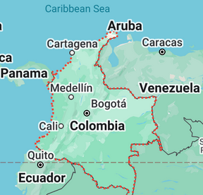

# Tidal Spear - Briefing

## Allgemeine Situation

**Vor 10 Jahren:** In der letzten Dekade hat Kolumbien stärkere wirtschaftliche und militärische Beziehungen zu NATO-Partnern aufgebaut, ohne der NATO selbst beizutreten. Kolumbien ist ein ressourcenreiches und daher strategisch wichtiges Land in Südamerika.

**Vor 3 Jahren:** Die CSAT-Allianz hat ihre geopolitischen Bestrebungen in Südamerika intensiviert, insbesondere mit dem Ziel des Abbaus von Öl und Seltenen Erden. Im Norden des Landes wurden neue Bodenschätze entdeckt.

**Vor 2 Jahren:** Die CSAT-Allianz stationierte Truppen in Südamerika in der Nähe von Panama, offiziell zur Sicherung der eigenen Handelsrouten.

**Vor 1 Jahr:** CSAT begann mit Anti-Piraterie-Einsätzen im Ostpazifik und verletzte dabei mehrfach kolumbianische Hoheitsgewässer. Die Spannungen zwischen der CSAT und der kolumbianischen Regierung nahmen zu.

**Vor 6 Monaten:** Offiziell aufgrund der fehlenden Unterstützung bei der Pirateriebekämpfung durch die kolumbianische Regierung und zur Wahrung der eigenen Interessen begann CSAT einen Angriffskrieg und landete im Westen Kolumbiens. Die NATO-Staaten verhängten sofort Sanktionen gegen die CSAT. Auf internationaler Ebene begannen diplomatische Bemühungen, um den Abzug der CSAT-Truppen zu erreichen.

**Vor 5 Monaten:** CSAT erzielte anfänglich Geländegewinne, aber durch die wirtschaftliche Unterstützung der NATO-Länder konnte das kolumbianische Militär die aus dem Nordwesten vorrückenden CSAT-Streitkräfte in der Mitte des Landes binden.

**Vor 4 Monaten:** CSAT schnitt den nördlichen Teil des Landes ab, woraufhin der Widerstand der kolumbianischen Armee im Norden zusammenbrach.
Aktuell rücken Truppen der CSAT auf die US-Basis **Nereus**, in Colombia etwa 100 km von Cartagena entfernt, zu.
Dort sind Teile der Triton Company stationiert.

**Vor 4 Monaten:** Zeitpunkt des Evaluationsevent

# Evaluationevent

## Allgemeine Lage

CSAT Truppen sind in den Norden von Colombia vorgedrungen.
Man geht davon aus, das ein Angriff der CSAT auf die US-Basis **Nereus** bevorsteht.
Da aktuell zu wenig Truppen und Material vorhanden sind wurde die Evakuierung von **Nereus** befohlen.
Der Träger **Hemetten** hat eine Übung in der karibischen See abgebrochen und ist bereit Material und Truppen der US-Basis **Nereus** aufzunehmen.
Vorhandenes Material soll auf die Hemetten und Begleitschiffe verbracht werden, die **Triton Company** vor Ort verzögert mögliche Feindkräfte.

### Eigene Lage (USMC)

Wir befinden uns in der **Basis Nereus**.
Die **Hemetten** befindet sich nördlich von **Nereus**.
Die **FOB Pontus** befindet südlich der **Basis Nereus**.

### Feindliche Lage (CSAT)

CSAT Truppen wurden mit Drohnen im Süden bei Currulao aufgeklärt.
Geheimdienstinformation zufolge steht ein Angriff bevor, daher geht man davon aus, dass CSAT Truppen bei Sicht das Feuer eröffnen.
Die vermutete Absicht des Feinde ist, nach Norden vorzurücken um die FOB Pontus und Base Nereus zu nehmen, um Material und Informationen der USMC zu erbeuten.

### Zivile Lage

Zivilisten sind überwiegend aus den umliegenden Dörfer in die Städte geflohen.
Vereinzelt können Zivilisten angetroffen werden.
Aus den bisherigem Verhalten der CSAT geht hervor, dass diese Zivilisten als Arbeitskräfte nutzen wollen.
Daher ist davon auszugehen, dass Zivilisten nicht von CSAT Truppen beschossen.

### Auftrag

Der Auftrag der **Triton Company** ist es:
1. Vorhanden Informationen und Material aus der FOB Pontus zu bergen.
2. Material su der Base Nereus auf die Hemetten vebringen.
3. Feind verzögern bis Material aus Base Nereus auf die Hemetten verbracht wurde.
4. Triton Company auf die Hemetten verschieben.

[Spoiler: Weiter zum Briefing: Hauptevent - Schicht 1](./briefing-main-event-1.html).

