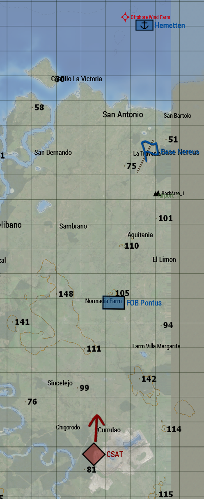

# Tidal Spear - Briefing

## Allgemeine Situation



**Vor 4 Monaten:** Zeitpunkt des Evaluationsevent

# Evaluationevent

## Allgemeine Lage

CSAT Truppen sind in den Norden von Colombia vorgedrungen.
Man geht davon aus, das ein Angriff der CSAT auf die US-Basis **Nereus** bevorsteht.
Da aktuell zu wenig Truppen und Material vorhanden sind wurde die Evakuierung von **Nereus** befohlen.
Der Träger **Hemetten** hat eine Übung in der karibischen See abgebrochen und ist bereit Material und Truppen der US-Basis **Nereus** aufzunehmen.
Vorhandenes Material soll auf die Hemetten und Begleitschiffe verbracht werden, die **Triton Company** vor Ort verzögert mögliche Feindkräfte.

### Eigene Lage (USMC)

Wir befinden uns in der **Basis Nereus**.
Die **Hemetten** befindet sich nördlich von **Nereus**.
Die **FOB Pontus** befindet südlich der **Basis Nereus**.

### Feindliche Lage (CSAT)

CSAT Truppen wurden mit Drohnen im Süden bei Currulao aufgeklärt.
Geheimdienstinformation zufolge steht ein Angriff bevor, daher geht man davon aus, dass CSAT Truppen bei Sicht das Feuer eröffnen.
Die vermutete Absicht des Feinde ist, nach Norden vorzurücken um die FOB Pontus und Base Nereus zu nehmen, um Material und Informationen der USMC zu erbeuten.

### Zivile Lage

Zivilisten sind überwiegend aus den umliegenden Dörfer in die Städte geflohen.
Vereinzelt können Zivilisten angetroffen werden.
Aus den bisherigem Verhalten der CSAT geht hervor, dass diese Zivilisten als Arbeitskräfte nutzen wollen.
Daher ist davon auszugehen, dass Zivilisten nicht von CSAT Truppen beschossen.

### Absichten

Die Absichten der **Triton Company** sind es:
1. Vorhanden Informationen und Material aus der FOB Pontus zu bergen.
2. Material zu der Base Nereus auf die Hemetten verbringen.
3. Feind verzögern bis Material aus Base Nereus auf die Hemetten verbracht wurde.
4. Restliche Material und Informationen in Basis **Nereus** vernichten.
5. Triton Company auf die Hemetten verschieben.

## Weiter

[ACHTUNG Spoiler: Weiter zum Briefing: Hauptevent - Schicht 1](./briefing-main-event-1.html).

[ACHTUNG Spoiler: Weiter zum Briefing: Hauptevent - Schicht 2](./briefing-main-event-2.html).

[ACHTUNG Spoiler: Weiter zum Briefing: Hauptevent - Schicht 3](./briefing-main-event-3.html).

