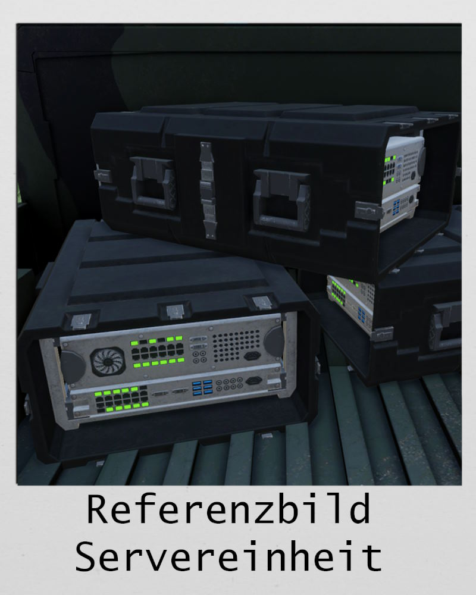

# Tidal Spear - Briefing - Evaluationsevent

## Allgemeine Situation



# Hauptevent

### Allgemeine Lage

Die USA intervenierten im Konflikt in Kolumbien zwischen der CSAT und dem kolumbianischen Militär.
Es wird eine zweite Front im Norden des Landes eröffnen.
Die Triton Company wurde in die Region verlegt um anzulanden und einen Brückenkopf abzusichern.

---

### Eigene Lage
Die Trägerflotte der **USS Basking**, begleitet von den Schiffen **USS Remora** und **USS Hammerhead**, befindet sich im südkaribischen Meer.  
Die **Triton Company** setzt sich aus folgenden Einheiten zusammen:  
- **Marine Raiders:** Ghost Crab 1-1  
- **Marine Rifle Platoons:** Otter und Barracuda  
- **Vehicle Platoon:** Alligator  

Die **US Navy Logistics Support Group** stellt der Triton-Kompanie logistische Unterstützung als **Remora** (erreichbar auf Kanal 4 **Logistic**).  
Die **US Navy** stellt den Medevac **Dustoff 9-1** (erreichbar auf Kanal 1 **SOS**).  
Luftnahunterstützung erfolgt durch die US Navy Kampfhubschrauber **Moray 1-1** und **Moray 1-2**.  
Luftüberlegenheit wird durch die US Navy Kampfjets **Eagle 1-1** und **Eagle 1-2** sichergestellt.  

**Startpunkte – Triton Company:**  
- **Schicht 1:** Begleitschiff **USS Remora**  
- **Schicht 2/3:** An Land **T1 - Homestead**  

---

### Feindliche Lage
Feindliche Kräfte befinden sich in Bataillonsstärke im Einsatzgebiet.  
Die Feindtruppen bestehen aus:  
- Infanterie  
- Mechanisierter Infanterie  
- Gepanzerten Radfahrzeugen  
- Helikoptern  

Mit Luftunterstützung durch Jets ist zu rechnen.  
Versorgungswege des Feindes verlaufen entlang der markierten MSRs im Osten, Süden und Westen.  
CSAT-Truppen haben sich über die letzten vier Monate eingegraben und die Infrastruktur für ihre Zwecke umgebaut.  
Pioniereinheiten haben Bunker errichtet und Compoundmauern teilweise gegen Fahrzeugdurchbrüche verstärkt.

#### Minenlage
- CSAT-Pioniere setzen ausschließlich Anti-Fahrzeug-Minen in Minensperren ein.  
- Minensperren sind durch Schilder markiert.  
- Anti-Personen-Minen werden nicht eingesetzt.  

---

### Neutrale Lage
Keine neutralen Kräfte im Einsatzgebiet.

---

### Zivile Lage
Die Mehrheit der Zivilbevölkerung ist vor den CSAT-Streitkräften geflohen.  
Mit vereinzelten zivilen Kontakten ist jedoch zu rechnen.

---

### Weisungen
Das Ziel ist die Etablierung eines Brückenkopfes und die Zerschlagung der CSAT-Streitkräfte im Einsatzgebiet von **Operation Tidal Spear**. Die Operation ist in drei Schichten aufgeteilt.

### Schicht 1: Anlandung und Brückenkopf Errichtung  
1. **Sichern T1 - Homestead:** Muss intakt gesichert werden, um die Anlandung der USS Remora zu ermöglichen. Ziel ist die Nutzung von T1 - Homestead als Versorgungspunkt.
2. **Sichern T1 - Warehouse:** Muss intakt gesichert werden und dient als Staging Area für die Logistik.
3. **Extraction Servereinheit aus T1 - Big Brain (Ziel für Ghost Crab):** Servereinheit extrahieren, Helibasis zerstören.
4. **Sichern T1 - Concrete:** Die Stadt San Antero muss gesichert werden, um einen Perimeter für T1 - Homestead aufzubauen.

### Schicht 2: Brückenkopf absichern  
1. **Sichern T2 - Broadway:** Zukünftiger Versorgungspunkt und Staging Area für die Logistik.
2. **Sichern T2 - Pickle:** Hochburg der CSAT, flankiert Ziel D-Point.
3. **Vernichten T2/3 - Old Grudge (Ziel für Ghost Crab):** Helibasis angreifen, Maschinen zerstören.

### Schicht 3: Perimeter vergrößern  
1. **Sichern T3 - Dirtway:** Zukünftiger Versorgungspunkt für weitere Operationen.
2. **Verminen T2/3 - Old Grudge (Ziel für Ghost Crab):** Brücke dient als Übersetzpunkt. Brücke muss mit Minen und Blockaden versehen werden.
3. **Sichern T3 - D-Point:** Feindliche FOB angreifen und CSAT-Truppen im Einsatzgebiet zerschlagen.

---

# Durchführung Schicht 1 - Freitag Abend 17.1.2025  

> bei Fragen zur Durchführung, im [Discord an @maximann410.](https://discord.com/channels/1230998538926952578/1230998539388190792) wenden.

Slotten/Joinen auf Server: ab 18:00 Uhr  
Führungsbesprechung Ingame: 18:30 Uhr  
Start/Einleitende Worte: 19:00 Uhr  
Missionsstart: 19:15 Uhr  

## Einzelaufträge

### Phase 0 – Herstellung der Einsatzbereitschaft und Aufklärung Strand

- **Schnelle Aufklärung** von West, Süd und Ost durch Luft (Triton 8).

#### Otter, Barracuda und Alligator
- **Herstellung der Einsatzbereitschaft**  
  - **Ausrüsten der Fahrzeuge**:
    - **Otter 1**: LCVP-Landungsboot (Personentransport)  
    - **Otter 2**: LCVP-Landungsboot (Personentransport)  
    - **Otter Actual**: Aufsitzen auf Landungsboot von Otter 1 oder Otter 2  
    - **Alligator**:  
      - Alpha: 2x LAV  
      - Bravo: 2x Schnellboot Minigun (mit 40mm)    
    - **Barracuda 1**: LCVP-Landungsboot (Personentransport)  
    - **Barracuda 2**: LCVP-Landungsboot (Personentransport)  
    - **Barracuda Actual**: Aufsitzen auf Landungsboot von Barracuda 1 oder Barracuda 2  
  - **Interne Absprache** für Vorgehen untereinander (und mit Dustoff und Triton) über:
    - Konvoi-Parameter, Verhalten unter Beschuss, Anpassung der Fahrzeugwahl, Ausrüstung, medizinische Lage.

- **Interne Absprache**  
  - Vorgehen untereinander (und mit Dustoff und Triton).  
  - Konvoiparameter, Verhalten unter Beschuss, Anpassung der Fahrzeugwahl.  
  - Ausrüstung, medizinische Lage.  

#### Capybara
- **Herstellung der Einsatzbereitschaft**  
  - Transportiert mit 3x LCVP-Landungsboot (Frachttransport):  
    - 1x TOW-Humvee  
    - 2x SAG-Humvee  
    - Munitionskisten  

#### Dustoff
- **Interne Absprache** für Vorgehen mit Otter, Barracuda, Ghost Crab und Alligator.  
- Herstellung der Einsatzbereitschaft.  

#### Ghost Crab
- **Herstellung der Einsatzbereitschaft**  
  - **Ausrüsten mit Fahrzeugen**:
    - 2x Schnellboot Minigun (mit 40mm)  
  - **Absprache mit Triton**:
    - Ziele definieren  
    - Unterstützung Strand  
    - Sicherung der Servereinheit aus T1 - Big Brain  

---

### Phase 1 – Verlegung der Truppen zu T1 Homestead

#### **Einheiten**: Otter, Barracuda, Alligator Bravo, Ghost Crab und Capybara  
- Verlegung zu T1 Homestead über Wasser und **Anlandung Barracuda, Alligator und Capybara**.  
- Bei Anlandung:  
  - **Alligator Bravo und Ghost Crab**: Vernichtung feindlicher Stellungen.  
  - **Otter, Ghost Crab und Capybara**: Anlanden am Strand.  

#### Alligator Alpha und Triton
- Verlegung zum Strand als 3er-Konvoi.  

#### Dustoff
- Einsatzbereitschaft für Aufträge.  

#### Pelican
- Bereitstellung von 2x LAV am Strand für Alligator Bravo.  

#### Moray
- Vorbereitung des Strands zur Landung.  
- Bereitstellung von Luftnahunterstützung.  

#### Eagle
- Sicherstellung der Luftüberlegenheit.  

---

### Phase 2 – Sichern von T1 Homestead

#### Alligator Alpha
- Sicherung eigener Teile.  
- Herstellung der Feuerüberlegenheit.  
- Schaffen des Momentums zur Einnahme der Anlage - Homestead und Warehouse.  

#### Alligator Bravo
- Umsteigen auf LAVs.  

#### Otter und Barracuda
- Sichern von T1 Homestead und Warehouse.  

#### Ghost Crab
- Verlegung zum ersten Missionsziel.  

#### Capybara
- Ausladen der Landungsschiffe am Strand.  

#### Moray
- Bereitstellung von Luftnahunterstützung.  

#### Eagle
- Sicherstellung der Luftüberlegenheit.  

---

### Phase 3 – Abmarsch zu T1 Concrete

#### Alligator
- Absicherung des Umfelds der Anlage.  
- Unterstützung eigener Teile.  

#### Otter
- Abmarsch Richtung Südost.  
- Einnahme des Vororts vor T1 Concrete.  

#### Barracuda
- Abmarsch Richtung Ost.  
- Einnahme der Hügelkante vor T1 Concrete.  

#### Remora (Capybara und Pelican)
- Bereitstellung von Versorgung bei Warehouse.  

#### Moray
- Bereitstellung von Luftnahunterstützung.  

#### Eagle
- Sicherstellung der Luftüberlegenheit.  

---

### Phase 4 – Nehmen von Concrete

#### Alligator
- Absicherung des Umfelds der Anlage.  
- Unterstützung eigener Teile.  

#### Otter
- Einnehmen von Sector 1 über Stellung Otter T1.  

#### Barracuda
- Einnehmen von Sector 2 über Stellung Barracuda T1.  
- Bereitstellung von Nachschub für Ghost Crab.  

#### Remora (Capybara und Pelican)
- Abtransport der Boote, wenn Kapazität vorhanden.  

#### Ghost Crab
- Weiteres Halten von Big Brain bei möglicher Verstärkung des Feindes.  
- Unterstützung der Infanterie in Concrete.  
- Ggf. Einsatz von TOW-Humvees.  

#### Moray
- Bereitstellung von Luftnahunterstützung.  

#### Eagle
- Sicherstellung der Luftüberlegenheit.  

---

### Phase 6 – Abtransport

- Rückverlegung aller Einheiten zu T1-Warehouse zum Aufmunitionieren und Debrief.  

Missionsende: 23:30 Uhr  
Gruppenintern Feedback sammeln: bis 00:00 Uhr  
Gesamter Missionsfeedback in TS: ab 00:00 Uhr  

---

# Durchführung Schicht 2 - Samstag Nachmittag 18.1.2025  

> bei Fragen zur Durchführung, im [Discord an @maximann410.](https://discord.com/channels/1230998538926952578/1230998539388190792) wenden.

Slotten/Joinen auf Server: ab 13:00 Uhr  
Führungsbesprechung Ingame: 13:30 Uhr  
Missionsstart: 14:00 Uhr  

## Einzelaufträge

### Phase 0 – Herstellung der Einsatzbereitschaft

- **Schnelle Aufklärung** von Südost (Waldgebiet) durch Luft (Triton 8).  
- **Moray 1-2**: Aufsitzen auf Osprey.  
- **Eagle**: Unterstützung von Moray 1-2.  

#### Otter, Barracuda und Alligator
- **Herstellung der Einsatzbereitschaft**  
  - Ausrüsten der Fahrzeuge:  
    - **Otter 1**: LKW (Infanterie)  
    - **Otter 2**: LKW (Infanterie)  
    - **Otter Actual**: HUMVEE (SAG-2/M2/M240)  
    - **Alligator**: 4x LAV / 24 (freie Sitzplätze)  
    - **Barracuda**:  
      - **Barracuda Actual**: HUMVEE (SAG-2/M2/M240)  
      - **Barracuda 1**: LKW (Infanterie)  
      - **Barracuda 2**: HUMVEE (TOW), HUMVEE (M2), HUMVEE  
	  
#### Otter, Barracuda und Alligator
- **Herstellung der Einsatzbereitschaft**  
- Ausrüsten mit Fahrzeugen:  
  - **Otter 1**: LKW (Infanterie)  
  - **Otter 2**: LKW (Infanterie)  
  - **Otter Actual**: HUMVEE (SAG-2/M2/M240) 
  
#### Barracuda und Alligator
- **Herstellung der Einsatzbereitschaft**  
- Ausrüsten mit Fahrzeugen: 
  - **Barracuda 1**: LKW (Infanterie)  
  - **Barracuda 2**: HUMVEE (TOW), HUMVEE (M2), HUMVEE  
  - **Barracuda Actual**: HUMVEE (SAG-2/M2/M240)  
  
#### Alligator
- **Herstellung der Einsatzbereitschaft**  
- Ausrüsten mit Fahrzeugen:  
  - **Alligator**: 4x LAV

#### Triton, Otter, Barracuda, Dustoff und Alligator:
- **Interne Absprache** für Vorgehen untereinander:  
  - Konvoiparameter  
  - Verhalten unter Beschuss  
  - Anpassung Fahrzeugwahl, Ausrüstung, medizinische Lage  

#### Capybara
- Bereitstellung von Nachschub.  

#### Dustoff
- **Interne Absprache** für Vorgehen mit Otter, Barracuda, Ghost Crab und Alligator.  
- Einsatzbereitschaft herstellen.  

#### Ghost Crab
- **Herstellung der Einsatzbereitschaft**  
- Ausrüstung für Halo-Jump
- Absprache mit Triton, welche Ziele erfüllt werden müssen.  
- Aufsitzen auf Moray 1-2.  

---

### Phase 1 – Verlegung der Truppen zu T2 Broadway über Abladepunkt LKW

- Verlegung von Otter, Barracuda und Alligator zu T2 Broadway.  

#### Aufteilung:
- **Barracuda und Alligator**: über West.  
- **Otter**: entlang des Flusses über Ost.  

#### Dustoff
- Einsatzbereitschaft für Aufträge.  

#### Ghost Crab
- Durchführung Halo-Jump zu **Landepunkt für Halo-Jump, Ghost Crab**

---

### Phase 2 – Sichern von T2 Broadway

#### Alligator
- Sicherung eigener Teile.  
- Herstellung der Feuerüberlegenheit.  
- Schaffen des Momentums zur Einnahme der Anlage.  

#### Otter und Barracuda
- Sicherung der Anlage  
- Otter: Sicherung der Anlage überStellung Otter T2-B.  
- Barracuda: Sicherung der Anlage über Stellung Barracuda T2-B.  

#### Ghost Crab
- Gewinnen und Vernichten der Anlage Old Grudge. 
- Vorhandene Maschinen zerstören.  

#### Moray
- Bereitstellung von Luftnahunterstützung.  

#### Eagle
- Sicherstellung der Luftüberlegenheit.  

---

### Phase 3 – Abmarsch zu T2 Pickle

#### Alligator
- Unterstützung eigener Teile über die Straße.  

#### Otter
- Abmarsch Richtung Südost, Einnahme des Waldes vor T2 Pickle.  

#### Barracuda
- Abmarsch Richtung Südost, Einnahme des Waldes vor T2 Pickle.  

#### Remora (Capybara und Pelican)
- Bereitstellung von Versorgung bei Broadway.  

#### Ghost Crab
- Organisation des Abtransports zu T2 Pickle in die Nähe eigener Truppenteile.  

#### Moray
- Bereitstellung von Luftnahunterstützung.  

#### Eagle
- Sicherstellung der Luftüberlegenheit.  

---

### Phase 4 – Nehmen von T2 Pickle

#### Alligator
- Absicherung des Umfelds der Anlage.  
- Unterstützung eigener Teile über die Straßen.  

#### Otter
- Einnahme von Sector 1 über Stellung Otter T2-P.  

#### Barracuda
- Einnahme von Sector 2 über Stellung Barracuda T2-P.  
- Anschließende Einnahme von Sector 3 mit Ghost Crab.  

#### Ghost Crab
- Einnahme von Sector 3.  

#### Moray
- Bereitstellung von Luftnahunterstützung.  

#### Eagle
- Sicherstellung der Luftüberlegenheit.  

---

### Phase 5 – Abtransport

- Rückverlegung aller Einheiten zu T2 Broadway zum Aufmunitionieren und Debrief.  

Missionsende: 18:00 Uhr (hoffentlich etwas früher)  
**keine** Nachbesprechung am Nachmittag.  

---

# Durchführung Schicht 3 - Samstag Abend 18.1.2025  

> bei Fragen zur Durchführung, im [Discord an @maximann410.](https://discord.com/channels/1230998538926952578/1230998539388190792) wenden.  
> Technischer Serverneustart: 18:00 Uhr bis 18:15 Uhr  

Slotten/Joinen auf Server: ab 18:15 Uhr  
Führungsbesprechung Ingame: 19:00 Uhr  
Missionsstart: 19:30 Uhr  

### Phase 0 – Herstellung der Einsatzbereitschaft

- **Schnelle Aufklärung**  
  - Aufklärung von Osten (Dirtway) durch Luft (Triton 8).  

- **Morey**  
  - Morey 1-2: Aufsitzen auf Osprey.  
  - Eagle: Unterstützung von Morey 1-2.  

- **Otter, Barracuda und Alligator**  
  - **Herstellen der Einsatzbereitschaft:**  
    - **Ausrüsten der Fahrzeuge**  
      - **Otter 1**: HUMVEE (SAG-2/M2/M240), HUMVEE (M2) – 16 Plätze  
      - **Otter 2**: HUMVEE (SAG-2/M2/M240), HUMVEE – 15 Plätze  
      - **Otter Actual**: HUMVEE (M2), HUMVEE – 9 Plätze  
      - **Alligator Actual**: 4x LAV – 24 Plätze (freie Sitzplätze)  
      - **Barracuda**: HUMVEE (M2), HUMVEE – 9 Plätze  
      - **Barracuda 1**: HUMVEE (SAG-2/M2/M240), HUMVEE – 15 Plätze  
      - **Barracuda 2**: HUMVEE (SAG-2/M2/M240), HUMVEE (TOW) – 16 Plätze  

- **Interne Absprache**  
  - Vorgehen untereinander (und mit Dustoff und Triton).  
  - Konvoiparameter, Verhalten unter Beschuss, Anpassung der Fahrzeugwahl.  
  - Ausrüstung, medizinische Lage.  

- **Dustoff**  
  - Interne Absprache für Vorgehen mit Otter, Barracuda, Ghost Crab und Alligator.  
  - Herstellung der Einsatzbereitschaft.  

- **Ghost Crab**  
  - Ausrüsten für Halo-Jump, Aufsitzen auf Morey 1-2.  
  - Absprache mit Triton über Ziele.  

- **Remora (Capybara und Pelikan)**  
  - Bereitstellung für Luftversorgung bei Pickle.  

---

### Phase 1 – Verlegung der Truppen zu T3 Dirtway

- **Otter, Barracuda und Alligator**  
  - Verlegung zu T3 Dirtway.  
  - **Aufteilung:**  
    - Barracuda und Alligator: Verlegung über Osten.  
    - Otter: Verlegung am Fluss entlang über Norden.  

- **Dustoff**  
  - Einsatzbereitschaft für Aufträge.  

---

### Phase 2 – Sichern von T3 Dirtway

- **Alligator**  
  - Sicherung eigener Teile.  
  - Herstellung der Feuerüberlegenheit.  
  - Schaffen des Momentums zum Nehmen der Anlage.  

- **Otter**  
  - Sicherung der Anlage über Norden.  

- **Barracuda**  
  - Sicherung der Anlage über Süden.  

- **Ghost Crab**  
  - Verminen und Blockieren der Brücke.  

- **Moray**  
  - Bereitstellung von Luftnahunterstützung.  

- **Eagle**  
  - Sicherstellung der Luftüberlegenheit.  

---

### Phase 3 – Abmarsch zu T3 D-Point

- **Alligator**  
  - Aufbau von zwei Konvois:  
    - **Alpha**: Mit Otter und Ghost Crab.  
    - **Bravo**: Mit Barracuda.  

- **Otter**  
  - Aufbau eines Konvois mit Alligator Alpha.  

- **Barracuda**  
  - Aufbau eines Konvois mit Alligator Bravo.  

- **Ghost Crab**  
  - Aufbau eines Konvois mit Alligator Alpha, ggf. Aufsitzen in Alligator Alpha.  

- **Moray**  
  - Bereitstellung von Luftnahunterstützung.  

- **Eagle**  
  - Sicherstellung der Luftüberlegenheit.  

---

### Phase 4 – Nehmen von T3 D-Point

- **Alligator**  
  - Absicherung des Umfelds der Anlage.  
  - Unterstützung eigener Teile.  

- **Otter**  
  - Einnahme von Sector 1 über Stellung Otter T3-DP.  

- **Barracuda**  
  - Einnahme von Sector 2 über Stellung Barracuda T3-DP.  

- **Ghost Crab**  
  - Vernichtung der Artillerie im Süden.  
  - Anschließend Unterstützung der Infanterie in T3 D-Point (Sector 3).  

- **Moray**  
  - Bereitstellung von Luftnahunterstützung.  

- **Eagle**  
  - Sicherstellung der Luftüberlegenheit.  

---

### Phase 5 – Abtransport

- Sammeln auf der Freifläche vor D-Point.  

Missionsende: 23:30 Uhr  
Gruppenintern Feedback sammeln: bis 00:00 Uhr  
Gesamter Missionsfeedback in TS: ab 00:00 Uhr  

---

### Material

#### Servereinheit

#### Kartenmaterial

<iframe src="https://maps.plan-ops.fr/ViewMap/24268?t=mBMCNzC-COy14FkOnuhMXkjvul_tOHln39nAUIo3tw0" style="width:100%;height:80vh;border:0;" /> 

