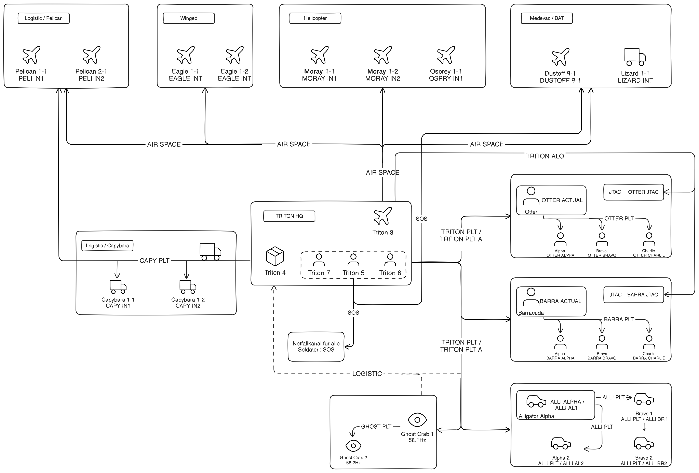

## Funkplan Triton Company

**Link: [Funkplan im Detail](./assets/tacops-2-radio-communication-plan.png)**   

## Funkplan als Tabelle

| Channel Nr. | Kurzname     | Beschreibung                  |
| ----------- | ------------ | ----------------------------- |
| 1           | SOS          | Emergency                     |
| 2           | TRITON PLT   | Triton Platoon                |
| 3           | TRITON PLT A | Triton Platoon Alternative    |
| 4           | LOGISTIC     | Logistic Request              |
| 5           | OTTER JTAC   | Otter JTAC                    |
| 6           | BARRA JTAC   | Barracuda JTAC                |
| 7           | GHOST JTAC   | Ghost Crab JTAC               |
| 8           | TRITON ALO   | Triton ALO and JTAC           |
| 9           | AIR SPACE    | Air Space                     |
| 10          | GHOST CRAB   | Ghost Crab                    |
| 11          | OTTER PLT    | Otter Platoon                 |
| 12          | BARRA PLT    | Barracuda Platoon             |
| 13          | OTTER ACTUAL | Otter Actual intern           |
| 14          | OTTER ALPHA  | Otter Alpha                   |
| 15          | OTTER AF1    | Otter Alpha Fireteam 1        |
| 16          | OTTER AF2    | Otter Alpha Fireteam 2        |
| 17          | OTTER AF3    | Otter Alpha Fireteam 3        |
| 18          | OTTER BRAVO  | Otter Bravo                   |
| 19          | OTTER BF1    | Otter Bravo Fireteam 1        |
| 20          | OTTER BF2    | Otter Bravo Fireteam 2        |
| 21          | OTTER BF3    | Otter Bravo Fireteam 3        |
| 22          | BARRA ACTUAL | Barracuda Actual intern       |
| 23          | BARRA ALPHA  | Barracuda Alpha               |
| 24          | BARRA AF1    | Barracuda Alpha Fireteam 1    |
| 25          | BARRA AF2    | Barracuda Alpha Fireteam 2    |
| 26          | BARRA AF3    | Barracuda Alpha Fireteam 3    |
| 27          | BARRA BRAVO  | Barracuda Bravo               |
| 28          | BARRA BF1    | Barracuda Bravo Fireteam 1    |
| 29          | BARRA BF2    | Barracuda Bravo Fireteam 2    |
| 30          | BARRA BF3    | Barracuda Bravo Fireteam 3    |
| 31          | ALLI PLT     | Alligator Platoon             |
| 32          | ALLI PLT A   | Alligator Platoon Alternative |
| 33          | CAPY PLT     | Capybara Platoon              |
| 34          | CAPY IN1     | Capybara 1 internal           |
| 35          | CAPY IN2     | Capybara 2 internal           |
| 36          | PELI IN1     | Pelican 1 internal            |
| 37          | PELI IN2     | Pelican 2 internal            |
| 38          | TRITON HQ    | Triton HQ internal            |
| 39          | EAGLE INT    | Eagle internal                |
| 40          | MORAY IN1    | Moray 1 internal              |
| 41          | MORAY IN2    | Moray 2 internal              |
| 42          | DUSTOFF 9-1  | Dustoff 9-1 internal          |

## Rauchfarben

**Grün**: Freund Markierung  
**Gelb**: JTAC Reserviert  
**Rot**: Feind Markierung  
**Blau**: LZ Markierung  
**Orange**: JTAC Reserviert  
**Violet**: Medevac  
**Weiß**: Verschleierung
