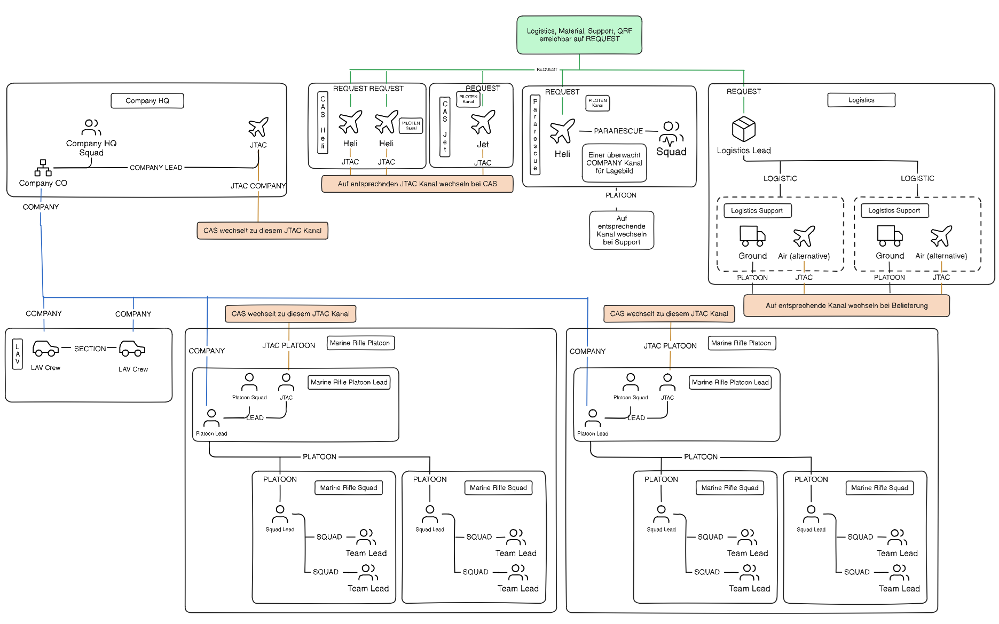

## Funkplan Triton Company

**Link: [Funkplan im Detail](./assets/tacops-3-general-radio-communication-plan.png)**

## Funkplan als Tabelle

| Channel Nr. | Kurzname      | Beschreibung                            |
|-------------|---------------|-----------------------------------------|
| 1           | REQUEST       | Anfragen: CAS, Logistik, QRF/Pararescue |
| 2           | TRITON PLT    | Triton Platoon                          |
| 3           | TRITON PLT A  | Triton Platoon Alternative              |
| 4           | LEVI JTAC     | Leviathan JTAC                          |
| 5           | BARRA JTAC    | Barracuda JTAC                          |
| 6           | TRITON JTAC   | Triton JTAC                             |
| 7           | AIR SPACE     | Pilotenkanal für Air Space              |
| 8           | LEVI PLT      | Leviathan Platoon                       |
| 9           | BARRA PLT     | Barracuda Platoon                       |
| 10          | LEVI LEAD     | Leviathan Lead intern                   |
| 11          | LEVI ALPHA    | Leviathan Alpha                         |
| 12          | LEVI AF1      | Leviathan Alpha Fireteam 1              |
| 13          | LEVI AF2      | Leviathan Alpha Fireteam 2              |
| 14          | LEVI BRAVO    | Leviathan Bravo                         |
| 15          | LEVI BF1      | Leviathan Bravo Fireteam 1              |
| 16          | LEVI BF2      | Leviathan Bravo Fireteam 2              |
| 17          | LEVI CHARLIE  | Leviathan Charlie                       |
| 18          | LEVI CF1      | Leviathan Charlie Fireteam 1            |
| 19          | LEVI CF2      | Leviathan Charlie Fireteam 2            |
| 20          | BARRA LEAD    | Barracuda Lead intern                   |
| 21          | BARRA ALPHA   | Barracuda Alpha                         |
| 22          | BARRA AF1     | Barracuda Alpha Fireteam 1              |
| 23          | BARRA AF2     | Barracuda Alpha Fireteam 2              |
| 24          | BARRA BRAVO   | Barracuda Bravo                         |
| 25          | BARRA BF1     | Barracuda Bravo Fireteam 1              |
| 26          | BARRA BF2     | Barracuda Bravo Fireteam 2              |
| 27          | BARRA CHARLIE | Barracuda Charlie                       |
| 28          | BARRA CF1     | Barracuda Charlie Fireteam 1            |
| 29          | BARRA CF2     | Barracuda Charlie Fireteam 2            |
| 30          | ALLI PLT      | Alligator Platoon                       |
| 31          | ALLI PLT A    | Alligator Platoon Alternative           |
| 32          | CAPY PLT      | Capybara Platoon                        |
| 33          | CAPY ALPHA    | Capybara 1 internal                     |
| 34          | CAPY BRAVO    | Capybara 2 internal                     |
| 35          | TRIDENT PARA  | Trident intern                          |
| 36          | TRIDENT MIKE  | Trident Abgesessen                      |
| 37          | TRIDENT HOTEL | Trident Helicopter                      |
| 38          | TRITON HQ     | Triton HQ internal                      |

## Rauchfarben

**Grün**: Freund Markierung  
**Gelb**: JTAC Reserviert  
**Rot**: Feind Markierung  
**Blau**: LZ Markierung  
**Orange**: JTAC Reserviert  
**Violet**: QRF/Pararescue  
**Weiß**: Verschleierung
