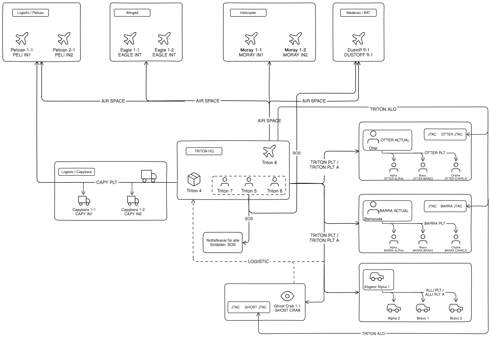

## Funkplan Triton Company

**Link: [Funkplan im Detail](./assets/tacops-2-radio-communication-plan.png)**   

## Funkplan als Tabelle

| Channel Nr. | Kurzname     | Beschreibung               | Platoon            | Squad         | Team             |
| ----------- | ------------ | -------------------------- | ------------------ | ------------- | ---------------- |
| 1           | SOS          | Emergency                  |                    |               |                  |
| 2           | TRITON PLT   | Triton Platoon             |                    |               |                  |
| 3           | TRITON PLT A | Triton Platoon Alternative |                    |               |                  |
| 4           | OTTER JTAC   | Otter JTAC                 | Otter Platoon      | Platoon Squad |                  |
| 5           | BARRA JTAC   | Barracuda JTAC             | Barracuda Platoon  | Platoon Squad |                  |
| 6           | TRITON JTAC  | Triton JTAC                |                    |               |                  |
| 7           | AIR SPACE    | Air Space                  |                    |               |                  |
| 8           | OTTER PLT    | Otter Platoon              | Otter Platoon      | Platoon Squad |                  |
| 9           | BARRA PLT    | Barracuda Platoon          | Barracuda Platoon  | Platoon Squad |                  |
| 10          | GHOST IN1    | Ghost Crab 1 internal      | Ghost Crab         | Squad 1       |                  |
| 11          | GHOST IN2    | Ghost Crab 2 internal      | Ghost Crab         | Squad 2       |                  |
| 12          | OTTER ACTUAL | Otter Actual intern        | Otter Platoon      | Platoon Squad |                  |
| 13          | OTTER ALPHA  | Otter Alpha                | Otter Platoon      | Alpha Squad   |                  |
| 14          | OTTER AF1    | Otter Alpha Fireteam 1     | Otter Platoon      | Alpha Squad   | Fireteam 1       |
| 15          | OTTER AF2    | Otter Alpha Fireteam 2     | Otter Platoon      | Alpha Squad   | Fireteam 2       |
| 16          | OTTER AF3    | Otter Alpha Fireteam 3     | Otter Platoon      | Alpha Squad   | Fireteam 3       |
| 17          | OTTER BRAVO  | Otter Bravo                | Otter Platoon      | Bravo Squad   |                  |
| 18          | OTTER BF1    | Otter Bravo Fireteam 1     | Otter Platoon      | Bravo Squad   | Fireteam 1       |
| 19          | OTTER BF2    | Otter Bravo Fireteam 2     | Otter Platoon      | Bravo Squad   | Fireteam 2       |
| 20          | OTTER BF3    | Otter Bravo Fireteam 3     | Otter Platoon      | Bravo Squad   | Fireteam 3       |
| 21          | BARRA ACTUAL | Barracuda Actual intern    | Barracuda Platoon  | Platoon Squad |                  |
| 22          | BARRA ALPHA  | Barracuda Alpha            | Barracuda Platoon  | Alpha Squad   |                  |
| 23          | BARRA AF1    | Barracuda Alpha Fireteam 1 | Barracuda Platoon  | Alpha Squad   | Fireteam 1       |
| 24          | BARRA AF2    | Barracuda Alpha Fireteam 2 | Barracuda Platoon  | Alpha Squad   | Fireteam 2       |
| 25          | BARRA AF3    | Barracuda Alpha Fireteam 3 | Barracuda Platoon  | Alpha Squad   | Fireteam 3       |
| 26          | BARRA BRAVO  | Barracuda Bravo            | Barracuda Platoon  | Bravo Squad   |                  |
| 27          | BARRA BF1    | Barracuda Bravo Fireteam 1 | Barracuda Platoon  | Bravo Squad   | Fireteam 1       |
| 28          | BARRA BF2    | Barracuda Bravo Fireteam 2 | Barracuda Platoon  | Bravo Squad   | Fireteam 2       |
| 29          | BARRA BF3    | Barracuda Bravo Fireteam 3 | Barracuda Platoon  | Bravo Squad   | Fireteam 3       |
| 30          | ALLI PLT     | Alligator Platoon          | Alligator Platoon  |               |                  |
| 31          | ALLI ALPHA   | Alligator Alpha            | Alligator Platoon  | Alpha Squad   |                  |
| 32          | ALLI AL1     | Alligator Alpha 1 internal | Alligator Platoon  | Alpha Squad   | Alpha 1 internal |
| 33          | ALLI AL2     | Alligator Alpha 2 internal | Alligator Platoon  | Alpha Squad   | Alpha 2 internal |
| 34          | ALLI BRAVO   | Alligator Bravo            | Alligator Platoon  | Bravo Squad   |                  |
| 35          | ALLI BR1     | Alligator Bravo 1 internal | Alligator Platoon  | Bravo Squad   | Bravo 1 internal |
| 36          | ALLI BR2     | Alligator Bravo 2 internal | Alligator Platoon  | Bravo Squad   | Bravo 2 internal |
| 37          | CAPY PLT     | Capybara Platoon           | Capybara Platoon   |               |                  |
| 38          | CAPY IN1     | Capybara 1 internal        | Capybara Platoon   | Capybara 1    |                  |
| 39          | CAPY IN2     | Capybara 2 internal        | Capybara Platoon   | Capybara 2    |                  |
| 40          | PELI IN1     | Pelican 1 internal         | Pelican 1          |               |                  |
| 41          | PELI IN2     | Pelican 2 internal         | Pelican 2          |               |                  |
| 42          | TRITON HQ    | Triton HQ internal         | Triton HQ          |               |                  |
| 43          | EAGLE INT    | Eagle internal             | Eagle Wing         |               |                  |
| 44          | MORAY IN1    | Moray 1 internal           | Moray 1            |               |                  |
| 45          | MORAY IN2    | Moray 2 internal           | Moray 2            |               |                  |
| 46          | OSPRY IN1    | Osprey 1 internal          | Osprey 1           |               |                  |
| 47          | DUSTOFF 9-1  | Dustoff 9-1 internal       | Dustoff            |               |                  |
| 48          | LIZARD INT   | Lizard 1 internal          | Lizard 1           |               |                  |
| 49          | GHOST PLT    | Ghost Crab Platoon (empty) | Ghost Crab Platoon |               |                  |
| 50          | MISC         | Miscellaneous              |                    |               |                  |

## Rauchfarben

**Grün**: Freund Markierung  
**Gelb**: JTAC Reserviert  
**Rot**: Feind Markierung  
**Blau**: LZ Markierung  
**Orange**: JTAC Reserviert  
**Violet**: Medevac  
**Weiß**: Verschleierung
