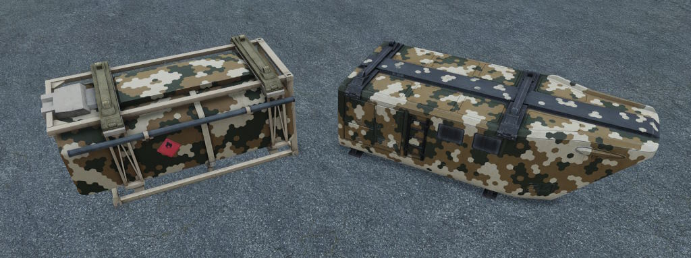

# Tidal Spear - Briefing - Evaluationsevent

## Allgemeine Situation



**Vor 4 Monaten:** Zeitpunkt des Evaluationsevent

| Ablauf \- Samstag Abend | 21.12.2024 |
| ----- | :---- |
| Slotten/Joinen auf Server | ab 18:00 Uhr |
| Führungsbesprechung Ingame | 18:30 Uhr |
| **Start/Einleitende Worte** | **19:00 Uhr** |
| Missionsstart | 19:15 Uhr |

# LADEF - Evaluationevent

## Allgemeine Lage

CSAT Truppen sind in den Norden von Colombia vorgedrungen.
Man geht davon aus, das ein Angriff der CSAT auf die US-Truppen bevorsteht.
Da aktuell zu wenig Truppen und Material vorhanden sind wurde die Evakuierung von **Nereus** befohlen.
Der Träger **Basking** hat eine Übung in der karibischen See abgebrochen und ist bereit Material und Truppen der US-Basis **Nereus** aufzunehmen.
Vorhandenes Material soll auf die Basking und Begleitschiffe verbracht werden, die **Triton Company** vor Ort verzögert mögliche Feindkräfte.

---

### Eigene Lage (USMC)

Wir (**Triton Company**) befinden uns in der **Basis Nereus**.
Die Begleitschiffe **Remora** und **Hammerhead** befindet sich nördlich von **Nereus**.
Der Träger **Basking** befindet sich nordöstlich der **Basis Nereus**.
Die **FOB Pontus** befindet südlich der **Basis Nereus**, die Funkverbindung ist abgebrochen und die Lage unklar.

Anmerkung: MedEvac und Piloten starten auf der Träger **Basking**.

---

### Feindliche Lage (CSAT)

CSAT Truppen wurden mit Drohnen im Süden bei Currulao und vor der Brücke westlich Sincelejo aufgeklärt.
Geheimdienstinformation zufolge steht ein Angriff bevor, daher geht man davon aus, dass CSAT Truppen bei Sicht das Feuer eröffnen.
Die vermutete Absicht des Feindes ist, nach Norden vorzurücken, um die **FOB Pontus** und die **Basis Nereus** zu nehmen und Material sowie Informationen über die amerikanische Präsenz zu erbeuten.

---

### Zivile Lage

Zivilisten sind zu großen Teilen geflohen oder haben Zuflucht in ihren Heimen gesucht.

---

### Auftrag

1.  Sichern der **FOB Pontus**
2.  Vorhandenes Personal und **zehn (10) Servereinheiten** auf die **Remora** verbringen.
3. Evakuierung und **Abtransport** des Material von  **Basis Nereus** absichern.

---

### Vorbefehle

**Feuerstatus:**  
Gelb  

**Geschwindigkeit Konvoi (Vorschlag):**  
- **Freundliches Gebiet**: 30 km/h innerorts, 70 km/h außerorts  
- **Feindliches Gebiet**: 15 km/h innerorts, 50 km/h außerorts  

---

### **Durchführung**

#### **Phase 0 – Herstellung der Einsatzbereitschaft und Aufklärung kritischer Bereiche**  
- **Aufklärung:**  
  Schnelle Aufklärung des westlichen und südlichen Gebiets durch Luftaufklärung (Triton 8).  

- **Otter, Barracuda und Alligator:**  
  Herstellung der Einsatzbereitschaft  
  - **Fahrzeugausrüstung:**  
    - **Otter Actual:** Humvee SAG-2/M2/M240.  
    - **Otter 1:** Humvee TOW, Humvee M2, Humvee.  
    - **Otter 2:** Humvee TOW, Humvee M2, Humvee.  

    - **Barracuda Actual:** Humvee SAG-2/M2/M240.    
    - **Barracuda 1:** Humvee M2, Humvee, Humvee SAG-2/M2/M240.  
    - **Barracuda 2:** Humvee M2, Humvee.  

    - **Alligator:** 2x LAV oder 1x LAV, 1x AAVP.  

  - **Absprache:**  
    - Interne Koordination mit Lizard, Dustoff und Triton zu:  
      - Konvoiparametern, Verhalten unter Beschuss.  
      - Anpassung der Fahrzeugwahl, Ausrüstung und medizinischer Lage.  

- **Lizard:**  
  - Herstellung der Einsatzbereitschaft
    - **Fahrzeugausrüstung:** CGR CAT1A2 (Medizinisch)
  - **Absprache:**  
    - Interne Koordination mit Lizard, Dustoff und Triton zu:  
      - Konvoiparametern, Verhalten unter Beschuss.  
      - Anpassung der Fahrzeugwahl, Ausrüstung und medizinischer Lage.  

- **Dustoff:**  
  - Herstellung der Einsatzbereitschaft
  - **Absprache:**  
    - Interne Koordination mit Lizard, Dustoff und Triton zu:  
      - Konvoiparametern, Verhalten unter Beschuss.  
      - Anpassung der Fahrzeugwahl, Ausrüstung und medizinischer Lage.  

- **Ghost Crab:**  
  - Herstellung der Einsatzbereitschaft
  - Ausrüstung der Buggys.  
  - Absprache mit Triton über primäre, sekundäre und tertiäre Missionsziele.  

---

#### **Phase 1 – Verlegung der Truppen zur FOB Pontus**  
- **Otter, Barracuda und Alligator:**  
  - Verlegung über Straße zu POI 1.  
  - Weiterfahrt zur FOB Pontus anhand Kartenmarkierung.  

- **Ghost Crab:**  
  - Verlegung zum ersten Missionsziel basierend auf Aufklärungsdaten.  

- **Dustoff:**  
  - Einsatzbereitschaft an Basis Nereus herstellen.  

- **Triton 4 (Capybara und Pelikan):**  
  - Ausbau von Stellungen (z. B. Geschütze, Minenfelder).  
  - Abtransport von Gütern nach Stellungsausbau.  

---

#### **Phase 2 – Sicherung der FOB Pontus**  
- **Alligator:**  
  - Sicherung eigener Kräfte.  
  - Herstellung der Feuerüberlegenheit und Momentumgewinn für die Einnahme der Anlage.  

- **Otter:**  
  - Sicherung des nördlichen Vektors zur Unterstützung des Angriffs.  
  - Sturm auf die Anlage und Einnahme.  

- **Barracuda:**  
  - Sicherung des westlichen Vektors (Kreuzung).  
  - Unterstützung des Otter-Angriffs durch geeignete Feuerpositionen.  

---

#### **Phase 3 – Aufklärung der FOB Pontus und Umgebung**  
- **Alligator:**  
  - Absicherung des Umfelds der Anlage (FOB Pontus).  

- **Otter:**  
  - Rundum-Sicherung der Anlage.  
  - Auffindung von Zielobjekten (10 Server, ggf. Überlebende).  
  - Koordination des Abtransports mit Logistik.  

- **Barracuda:**  
  - Sicherung des westlichen Umfelds (Kreuzung).  

- **Triton 4 (Capybara und Pelikan):**  
  - Abtransport von Zielobjekten.  

---

#### **Phase 4 – Rückkehr zur Basis Nereus**  
- **Alligator, Otter und Barracuda:**  
  - Rückverlegung und Aufmunitionierung an Basis Nereus.  
  - Einnehmen von Verteidigungspositionen (Alligator: Allgemein, Otter: Süden, Barracuda: Westen).  

- **Triton 4 (Capybara und Pelikan):**  
  - Bereitstellen von TOW für Ghost Crab in Basis Nereus.  
  - Starten des Abtransports von Personal und Material zur Flotte.  

- **Ghost Crab:**  
  - Verlegung zur Basis für Ausrüsten mit TOW (Ausgabe über Logistikanfrage) und Verlegung zu POI 30 und POI 31.  
  - Einnehmen von Verteidigungspositionen POI 30 und POI 31

---

#### **Phase 5 – Verteidigung und Abtransport**  
- **Alligator, Otter und Barracuda:**  
  - Verteidigung der Basis Nereus (Äußerer Verteidigungsring).  

- **Triton 4 (Capybara und Pelikan):**  
  - Abtransport von Personal und Material zur Flotte.  

- **Ghost Crab:**  
  - Verteidigung der Basis Nereus bei POI 30 und POI 31.  
  - Abtransport über den Strand mit Unterstützung von Alligator.  

---

#### **Phase 6 – Abtransport**  
- **Alligator:**  
  - Verteidigung (Innerer Verteidigungsring).  
  - Ausweichen über den Strand nach Evakuierung der letzten Infanterie (Absprache mit Triton 4 und Ghost Crab).  

- **Otter:**  
  - Verteidigung (Innerer Verteidigungsring).  
  - Ausweichen nach Barracuda-Evakuierung per Helikopter (Absprache mit Triton 4).  

- **Barracuda:**  
  - Verteidigung (Innerer Verteidigungsring).  
  - Nach Materialabtransport: Evakuierung mit dem erstem verfügbaren Helikopter (Absprache mit Triton 4).  

- **Triton 4 (Capybara und Pelikan):**  
  - Abtransport des Personals zur Flotte.  

- **Ghost Crab:**  
  - Abtransport über den Strand mit Alligator.  

---

#### **Missionabschluss in Nachbesprechung im Teamspeak**  

| Ablauf \- Samstag Abend | 21.12.2024 |
| ----- | :---- |
| Missionsende | 23:30 Uhr |
| Gruppenintern Feedback sammeln | bis 00:00 Uhr |
| Gesamter Missionsfeedback in TS | ab 00:00 Uhr |

**Anmerkung:** Es wird ein Fragebogen ausgegeben.

### Material

#### Servereinheiten

#### CSAT Logistikcontainer

#### Kartenmaterial

<iframe src="https://maps.plan-ops.fr/ViewMap/24180/LiveFullScreen?t=CWOq8wWTzcubSwy4u6kK8RaiLIGSHkztBp0lm1m4oC4" style="width:100%;height:80vh;border:0;" /> 

---

Weiter

[Zum WIP-Briefing: Evaluationsevent](./briefing-evaluation-event.html).

[Weiter zum Briefing: Hauptevent - Schicht 1](./briefing-main-event-1.html).

[Weiter zum Briefing: Hauptevent - Schicht 2](./briefing-main-event-2.html).

[Weiter zum Briefing: Hauptevent - Schicht 3](./briefing-main-event-3.html).

